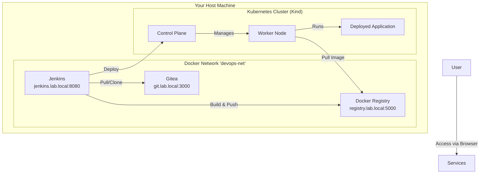
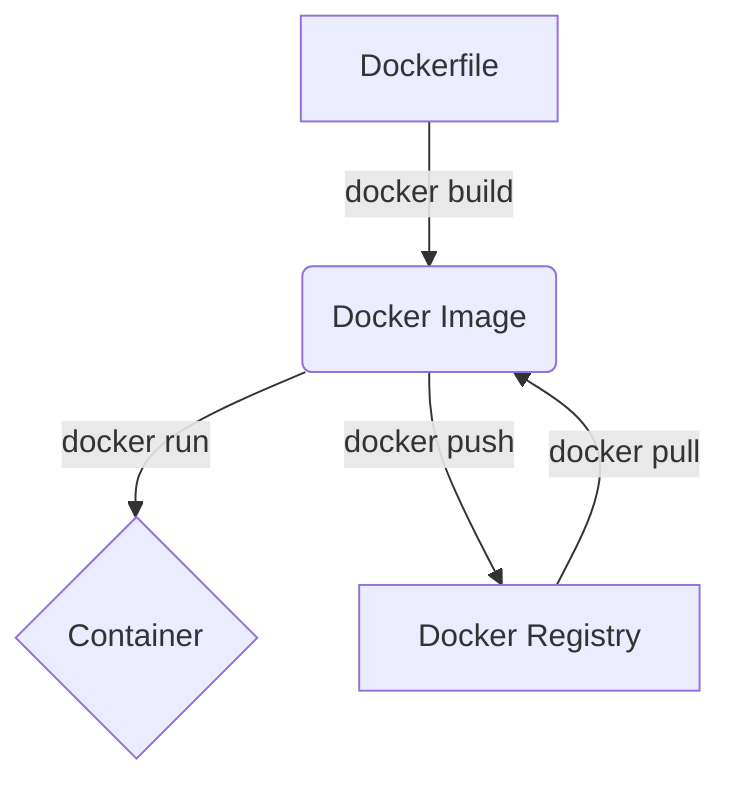
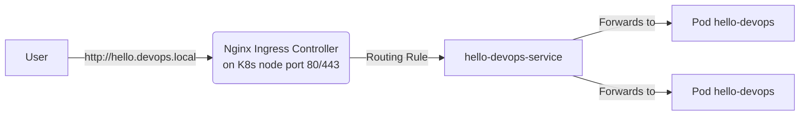
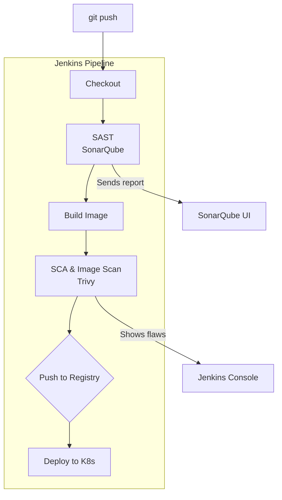
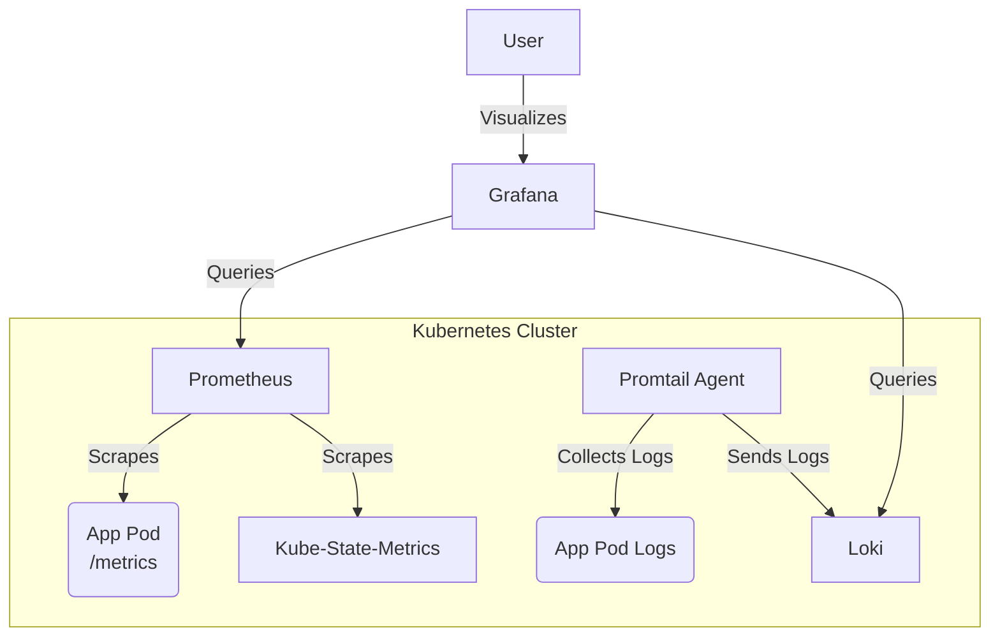
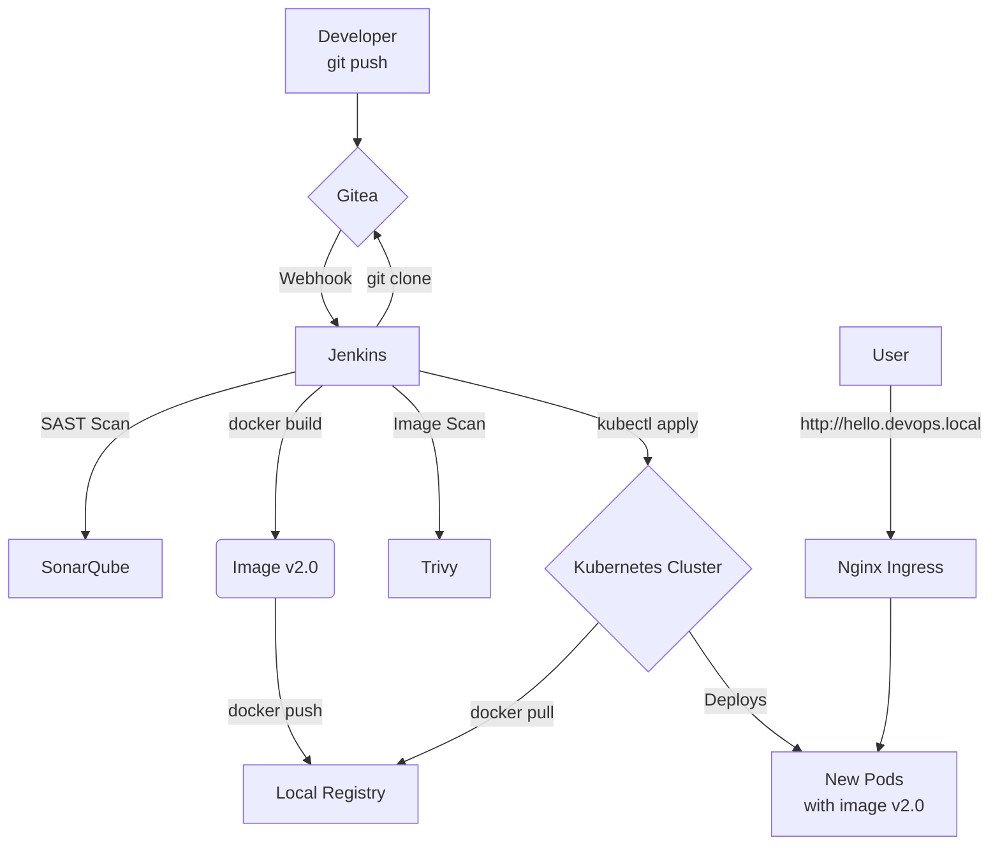

Welcome to this comprehensive course on DevOps culture and tooling. The goal is to guide you, step-by-step, from theory to practice, empowering you to build, secure, and automate a full Continuous Integration and Continuous Deployment (CI/CD) pipeline.

**Course Philosophy:**
Everything we learn will be put into practice in a **100% local lab environment**, running on your own machine using Docker. You will not need any cloud accounts or paid services. Every concept is illustrated with hands-on workshops and concrete examples.

## **Course Navigation**

*   [Module 00: Introduction to DevOps & Lab Setup](#module-00-introduction-to-devops--lab-setup)
*   [Module 01: Source Code Management with Gitea](#module-01-source-code-management-with-gitea)
*   [Module 02: Containerization with Docker](#module-02-containerization-with-docker)
*   [Module 03: Continuous Integration (CI) with Jenkins](#module-03-continuous-integration-ci-with-jenkins)
*   [Module 04: Orchestration with Kubernetes (via Kind)](#module-04-orchestration-with-kubernetes-via-kind)
*   [Module 05: Continuous Deployment (CD) to Kubernetes](#module-05-continuous-deployment-cd-to-kubernetes)
*   [Module 06: Reverse Proxy & Load Balancing (Nginx Ingress)](#module-06-reverse-proxy--load-balancing-nginx-ingress)
*   [Module 07: Infrastructure as Code (IaC) with Terraform](#module-07-infrastructure-as-code-iac-with-terraform)
*   [Module 08: Configuration Management with Ansible](#module-08-configuration-management-with-ansible)
*   [Module 09: Integrating Security (DevSecOps)](#module-09-integrating-security-devsecops)
*   [Module 10: Monitoring & Observability](#module-10-monitoring--observability)
*   [Module 11: Final Project - The Complete A-to-Z Pipeline](#module-11-final-project---the-complete-a-to-z-pipeline)
*   [Module 12: Conclusion & Next Steps](#module-12-conclusion--next-steps)


## **Module 00: Introduction to DevOps & Lab Setup**

### What is DevOps?

DevOps is not a tool, but a **culture** and a **philosophy**. It's a portmanteau of "Development" (Dev) and "Operations" (Ops). The goal is to break down the silos between development teams, who want to deliver new features quickly, and operations teams, who want to ensure production stability.

The pillars of DevOps are based on the **C.A.L.M.S** model:
*   **C**ulture: Fostering collaboration, sharing, and trust.
*   **A**utomation: Automating everything that is repetitive (tests, builds, deployments).
*   **L**ean: Optimizing processes, eliminating waste, and delivering value quickly.
*   **M**easurement: Collecting metrics to understand and improve the system.
*   **S**haring: Sharing knowledge, tools, and responsibilities.

### Our Local Lab Architecture

We will use `docker-compose` to orchestrate our lab services. This will allow us to easily start and stop all the necessary tools, which will communicate over a shared Docker network.



### Prerequisites

*   **Docker** and **Docker Compose** installed.
*   A text editor (e.g., VS Code).
*   A terminal.
*   Basic knowledge of the Linux command line.
*   **Kind** and **kubectl** installed for the Kubernetes module.

### Workshop: Launching the Lab with an Automated Script

To make setting up our lab environment as simple as possible, we will use a shell script. This script embodies the DevOps principle of automation. It will perform prerequisite checks, build our custom Jenkins image, start all services, and verify that everything is running correctly, providing a smooth start to the course.

#### Step 1: Create the Project Directory Structure

First, create a root folder for our project, for example, `devops-course-lab`. All subsequent files and folders will be created inside this one.

#### Step 2: Create the Custom Jenkins Image Definition

Our lab requires a Jenkins container that can execute Docker commands. The official Jenkins image doesn't include the Docker CLI, so we must build our own.

*   Inside `devops-course-lab`, create a new folder named `jenkins-image`.
*   Inside `jenkins-image`, create a file named `Dockerfile`.

**`jenkins-image/Dockerfile`:**
```dockerfile
# Start from the official Jenkins image
FROM jenkins/jenkins:lts

# Switch to the root user to install packages
USER root

# Install necessary dependencies and the Docker CLI
RUN apt-get update && apt-get install -y lsb-release curl gpg
RUN curl -fsSL https://download.docker.com/linux/debian/gpg | gpg --dearmor -o /usr/share/keyrings/docker-archive-keyring.gpg
RUN echo "deb [arch=$(dpkg --print-architecture) signed-by=/usr/share/keyrings/docker-archive-keyring.gpg] https://download.docker.com/linux/debian $(lsb_release -cs) stable" | tee /etc/apt/sources.list.d/docker.list > /dev/null
RUN apt-get update && apt-get install -y docker-ce-cli

# --- THE FIX IS HERE ---
# 1. Create the 'docker' group
#    The installation of docker-ce-cli doesn't create it, so we do it manually.
RUN groupadd docker

# 2. Add the 'jenkins' user to the 'docker' group
#    This allows the jenkins user to communicate with the Docker socket.
RUN usermod -aG docker jenkins

# Switch back to the jenkins user
USER jenkins
```

#### Step 3: Define the Lab Services with Docker Compose

At the root of the `devops-course-lab` folder, create your `docker-compose.yml` file. This file defines all the services needed for our course.

**`docker-compose.yml`:**

```yaml
version: '3.8'

services:
  gitea:
    image: gitea/gitea:latest
    container_name: gitea
    environment:
      - USER_UID=1000
      - USER_GID=1000
      - GITEA__database__DB_TYPE=sqlite3
      - GITEA__database__PATH=/data/gitea/gitea.db
      - GITEA__server__DOMAIN=localhost
      - GITEA__server__HTTP_PORT=3000
      - GITEA__server__ROOT_URL=http://localhost:3000/
      - GITEA__security__INSTALL_LOCK=true
      - GITEA__security__SECRET_KEY=changeme
      - GITEA__security__INTERNAL_TOKEN=changeme
    restart: unless-stopped
    volumes:
      - gitea-data:/data
      - /etc/timezone:/etc/timezone:ro
      - /etc/localtime:/etc/localtime:ro
    ports:
      - "3000:3000"
      - "2222:22"
    networks:
      - devops-net

  jenkins:
    build: ./jenkins-image
    container_name: jenkins
    privileged: true # Required for Docker-in-Docker
    user: root
    ports:
      - "8080:8080"
      - "50000:50000"
    volumes:
      - ./jenkins_home:/var/jenkins_home
      - /var/run/docker.sock:/var/run/docker.sock # Mount the Docker socket
    networks:
      - devops-net

  registry:
    image: registry:2
    container_name: registry2
    ports:
      - "5002:5000"
    volumes:
      - ./registry_data:/var/lib/registry
    restart: always
    networks:
      - devops-net

volumes:
  gitea-data:
  jenkins_home:
  registry_data:
  
networks:
  devops-net:
    name: devops-net
    driver: bridge
```

#### Step 4: Create the Automated Startup Script

This script is the main entry point for starting, stopping, and managing the lab. Create a new file named `start-lab.sh` at the root of your `devops-course-lab` directory.

**`start-lab.sh`:**
```bash
#!/bin/bash

# Startup Script for the DevOps CI/CD Lab
# This script configures and starts all necessary services for the course.

set -e

echo "🚀 Starting the DevOps CI/CD Lab"
echo "========================================"

# Colors for output
RED='\033[0;31m'
GREEN='\033[0;32m'
YELLOW='\033[1;33m'
BLUE='\033[0;34m'
NC='\033[0m' # No Color

# --- 1. Prerequisite Checks ---
echo -e "\n${YELLOW}1. Checking prerequisites...${NC}"

if ! command -v docker &> /dev/null; then
    echo -e "${RED}❌ Docker is not installed or not in your PATH.${NC}"
    exit 1
fi

# Function to find and use the correct docker compose command
compose_cmd() {
    if command -v docker-compose &> /dev/null; then
        docker-compose "$@"
    elif docker compose version &> /dev/null; then
        docker compose "$@"
    else
        echo -e "${RED}❌ Docker Compose is not installed.${NC}"
        echo -e "Please install the Docker Compose V2 plugin or the standalone docker-compose."
        exit 1
    fi
}

if ! docker info &> /dev/null; then
    echo -e "${RED}❌ Docker daemon is not running or not accessible.${NC}"
    exit 1
fi

echo -e "✅ ${GREEN}Docker and Docker Compose are available.${NC}"

# Allow arguments to be passed to docker-compose, like 'logs' or 'down'
if [ "$#" -gt 0 ]; then
    compose_cmd "$@"
    exit 0
fi

# --- 2. Clean Up Existing Resources ---
echo -e "\n${YELLOW}2. Cleaning up existing resources...${NC}"

if [ "$(compose_cmd ps -q)" ]; then
    echo -e "🧹 Shutting down existing services..."
    compose_cmd down --remove-orphans
fi
echo -e "✅ ${GREEN}Cleanup complete.${NC}"

# --- 3. Build and Start Services ---
echo -e "\n${YELLOW}3. Building and starting services...${NC}"

echo -e "📦 Building custom Jenkins image (this may take a few minutes on first run)..."
compose_cmd build --no-cache

echo -e "🚀 Starting services in detached mode..."
compose_cmd up -d

# --- 4. Verifying Service Health ---
echo -e "\n${YELLOW}4. Verifying service status...${NC}"

echo -e "⏳ Waiting for services to initialize (this can take up to a minute)..."

check_service() {
    local service_name="$1"
    local container_name="$2"
    local url="$3"
    local max_attempts=20
    local attempt=1
    
    echo -n -e "🔍 Verifying $service_name..."
    
    while [ $attempt -le $max_attempts ]; do
        http_status=$(curl -s -o /dev/null -L -w "%{http_code}" "$url")
        if [ "$http_status" = "200" ] || [ "$http_status" = "302" ]; then
            echo -e " ${GREEN}Online.${NC}"
            return 0
        fi
        echo -n "."
        sleep 5
        attempt=$((attempt + 1))
    done
    
    echo -e " ${RED}Offline.${NC}"
    echo -e "❌ ${RED}$service_name did not become available. Check logs with: ./start-lab.sh logs $container_name${NC}"
    return 1
}

# Verify key services
SERVICES_OK=true
# Gitea can be slow to start, so we wait a bit before checking
sleep 15 
check_service "Gitea" "gitea" "http://localhost:3000" || SERVICES_OK=false
check_service "Jenkins" "jenkins" "http://localhost:8080/login" || SERVICES_OK=false

# --- 5. Final Status and Information ---
echo -e "\n${YELLOW}5. Final lab status:${NC}"
compose_cmd ps

if [ "$SERVICES_OK" = true ]; then
    echo -e "\n🎉 ${GREEN}Lab started successfully!${NC}"
    
    echo -e "\n${BLUE}📋 Access Information:${NC}"
    echo -e "┌──────────────┬─────────────────────────┬──────────────────────────────────┐"
    echo -e "│ ${YELLOW}Service${NC}       │ ${YELLOW}URL${NC}                      │ ${YELLOW}Notes${NC}                               │"
    echo -e "├──────────────┼─────────────────────────┼──────────────────────────────────┤"
    echo -e "│ Gitea        │ http://localhost:3000   │ Create admin user on first visit │"
    echo -e "│ Jenkins      │ http://localhost:8080   │ Get initial password from log    │"
    echo -e "│ Docker Registry │ localhost:5000          │ For image pushes from pipeline   │"
    echo -e "└──────────────┴─────────────────────────┴──────────────────────────────────┘"
    
    echo -e "\n${BLUE}🎯 Next Steps:${NC}"
    echo -e "1. Open your browser and set up an admin account on Gitea: ${YELLOW}http://localhost:3000${NC}"
    echo -e "2. Log in to Jenkins: ${YELLOW}http://localhost:8080${NC}"
    echo -e "   - Get the initial password with: ${YELLOW}docker exec jenkins cat /var/jenkins_home/secrets/initialAdminPassword${NC}"
    echo -e "3. Configure Docker to trust the insecure registry (see course notes)."
    echo -e "4. Begin Module 1: Source Code Management."
    
else
    echo -e "\n❌ ${RED}One or more services failed to start correctly.${NC}"
    echo -e "Please check the logs for errors."
fi

echo -e "\n${YELLOW}💡 Useful Commands:${NC}"
echo -e "- View all logs:      ${YELLOW}./start-lab.sh logs${NC}"
echo -e "- View specific log:  ${YELLOW}./start-lab.sh logs jenkins${NC}"
echo -e "- Stop the lab:       ${YELLOW}./start-lab.sh down${NC}"

echo -e "\n========================================"
echo -e "🎓 ${GREEN}Happy DevOps Learning!${NC}"
```

#### Step 5: Make the Script Executable and Launch the Lab

Before running the script, you must give it execution permissions.

1.  **Make the script executable:**
    ```bash
    chmod +x start-lab.sh
    ```

2.  **Launch the lab:**
    Now, you can start the entire lab with one simple command:
    ```bash
    ./start-lab.sh
    ```
    The script will guide you through the process, check for prerequisites, build the Jenkins image, start all containers, and verify their status. If successful, it will provide you with all the URLs and information you need to begin the course.


3.  Launch the lab:
    ```bash
    docker-compose up -d
    ```

4.  **Docker Configuration for Local Registry (VERY IMPORTANT)**:
    Our registry is insecure (HTTP). We need to tell Docker to trust it. Edit (or create) the file `/etc/docker/daemon.json` (on Linux/Mac) and add:
    ```json
    {
      "insecure-registries" : ["localhost:5000", "registry:5000"]
    }
    ```
    > **Note:** `registry:5000` is necessary so that containers *inside* the Docker network (like Jenkins or Kubernetes/Kind) can access the registry by its service name.

    Then restart the Docker service: `sudo systemctl restart docker`.

#### Step 6: Configure Docker for the Local Registry

One final manual step is required. Our local Docker Registry is insecure (HTTP), so you must configure your Docker daemon to trust it.

*   Edit (or create) the Docker daemon configuration file. It is usually located at `/etc/docker/daemon.json` on Linux/Mac.
*   Add the following content:
    ```json
    {
      "insecure-registries" : ["localhost:5000", "registry:5000"]
    }
    ```
*   Save the file and **restart your Docker daemon**. On most Linux systems, this is done with `sudo systemctl restart docker`.

You are now fully set up and ready to begin the course!

### Sources & Further Reading

*   **Book:** *The Phoenix Project* by Gene Kim, Kevin Behr, and George Spafford.
*   **Documentation:** [Docker Compose Overview](https://docs.docker.com/compose/)

---

## **Module 01: Source Code Management with Gitea**

Every DevOps project starts with code. A version control system like Git is essential. Gitea is a lightweight alternative to GitLab or GitHub, perfect for our lab.

### Key Concepts

*   **Git:** A distributed version control system.
*   **Repository:** A folder containing your project and its Git history.
*   **Commit / Branch / Merge:** The basic Git operations for saving, isolating, and combining work.
*   **Webhook:** A mechanism that allows Gitea to notify another service (Jenkins) when an event occurs (e.g., a `push`).

### Workshop: Configure Gitea and Create Our Project

1.  **Access and Configuration:**
    *   Open your browser to `http://localhost:3000`.
    *   Follow the installation wizard.
        *   Database Type: `SQLite3`.
        *   **Gitea Base URL:** `http://gitea:3000` (important for internal Docker communication).
        *   Create your admin account.

2.  **Create a New Repository:**
    *   Log in, click the `+` icon -> "New Repository".
    *   Repository Name: `hello-devops`.
    *   Click "Create Repository".

3.  **Create Our Base Application:**
    *   In a new folder on your machine, create a file named `app.py`:
        ```python
        from flask import Flask
        import os

        app = Flask(__name__)

        @app.route('/')
        def hello():
            # An environment variable to demonstrate configuration
            version = os.environ.get('APP_VERSION', 'v1.0')
            return f"Hello, DevOps World! This is version: {version}"

        if __name__ == '__main__':
            app.run(host='0.0.0.0', port=5000)
        ```

4.  **Push the Code to Gitea:**
    ```bash
    # Replace <your_user> with your Gitea username
    git init
    git add app.py
    git commit -m "Initial commit"
    git branch -M main
    git remote add origin http://localhost:3000/<your_user>/hello-devops.git
    git push -u origin main
    ```

### Sources & Further Reading

*   **Documentation:** [Gitea Documentation](https://docs.gitea.io/)
*   **Tutorial:** [Pro Git Book](https://git-scm.com/book/en/v2)

---

## **Module 02: Containerization with Docker**

Docker allows us to "package" an application and its dependencies into a **container**. This ensures the application will run the same way everywhere.

### Key Concepts

*   **Docker Image:** A read-only template (the "recipe").
*   **Docker Container:** A runnable instance of an image (the "prepared dish").
*   **Dockerfile:** A text file containing instructions to build an image.
*   **Docker Registry:** An image storage service (like our local registry).



### Workshop: Dockerizing Our Application

1.  **Create the `Dockerfile`:** At the root of your `hello-devops` project, create this file:

    ```dockerfile
    # Use a lightweight base image
    FROM python:3.9-slim

    # Set the working directory
    WORKDIR /app

    # Install dependencies
    COPY requirements.txt .
    RUN pip install --no-cache-dir -r requirements.txt

    # Copy the application code
    COPY app.py .

    # Expose the application port
    EXPOSE 5000

    # Command to start the application
    CMD ["gunicorn", "--bind", "0.0.0.0:5000", "app:app"]
    ```

2.  **Create `requirements.txt`:**
    ```
    Flask==2.1.2
    gunicorn==20.1.0
    Werkzeug==2.3.7
    ```
    > **Note:** We use `gunicorn`, a robust WSGI server, which is more suitable for "production" than Flask's built-in development server.

3.  **Build and Test the Image:**
    ```bash
    # Build the image
    docker build -t localhost:5000/hello-devops:1.0 .

    # Run a container to test it
    docker run -d --name test-app -p 8001:5000 -e APP_VERSION=v1.0-test localhost:5000/hello-devops:1.0

    # Check your browser at http://localhost:8001
    # Stop and remove the test container
    docker stop test-app && docker rm test-app
    ```

4.  **Push the Image to Our Local Registry:**
    ```bash
    docker push localhost:5000/hello-devops:1.0
    ```

5.  **Push the New Files to Gitea:**
    ```bash
    git add Dockerfile requirements.txt
    git commit -m "feat: Add Dockerfile for the application"
    git push origin main
    ```

### Sources & Further Reading

*   **Documentation:** [Docker Get Started](https://docs.docker.com/get-started/)
*   **Best Practices:** [Best practices for writing Dockerfiles](https://docs.docker.com/develop/develop-images/dockerfile_best-practices/)

---

## **Module 03: Continuous Integration (CI) with Jenkins**

Continuous Integration (CI) automates the building and testing of code with every change. Jenkins is the perfect tool to orchestrate this process.

### Key Concepts

*   **Pipeline:** A set of steps (build, test, push) executed by Jenkins.
*   **Jenkinsfile:** The definition of the pipeline as code, versioned with the application.
*   **Agent:** A machine (or container) where Jenkins executes tasks.

### Workshop: Create a CI Pipeline with Jenkins

1.  **Initial Jenkins Setup:**
    *   Access Jenkins: `http://localhost:8080`.
    *   Get the initial admin password: `docker exec jenkins cat /var/jenkins_home/secrets/initialAdminPassword`.
    *   Install suggested plugins and create your user.
    *   **Install the `Docker Pipeline` and `Gitea` plugins** via "Manage Jenkins" > "Manage Plugins".

2.  **Create the `Jenkinsfile`:**
    At the root of your `hello-devops` project, create a `Jenkinsfile`.

    ```groovy
    pipeline {
        agent any

        environment {
            REGISTRY_URL = 'registry:5000' // Jenkins communicates via Docker service name
            IMAGE_NAME = "hello-devops"
            IMAGE_TAG = "build-${env.BUILD_NUMBER}" // Use build number for a unique tag
        }

        stages {
            stage('Checkout') {
                steps {
                    checkout scm
                }
            }

            stage('Build & Push Docker Image') {
                steps {
                    script {
                        // 1. Build the image and store the resulting 'Image' object in a variable
                        def customImage = docker.build("${REGISTRY_URL}/${IMAGE_NAME}:${IMAGE_TAG}", ".")
                        
                        // 2. Call the .push() method on the 'Image' object
                        customImage.push()
                    }
                }
            }
        }

        post {
            always {
                // Clean up the image on the Jenkins agent to save space
                echo "Cleaning up local Docker image..."
                sh "docker rmi ${REGISTRY_URL}/${IMAGE_NAME}:${IMAGE_TAG} || true"
            }
        }
    }
    ```

3.  **Push the `Jenkinsfile` to Gitea:**
    ```bash
    git add Jenkinsfile
    git commit -m "ci: Add Jenkinsfile for CI pipeline"
    git push origin main
    ```

4.  **Create the Pipeline in Jenkins:**
    *   "New Item" > Name: `hello-devops-pipeline` > Type: `Pipeline` > OK.
    *   In the "Pipeline" section, choose "Pipeline script from SCM".
    *   SCM: `Git`.
    *   Repository URL: `http://gitea:3000/<your_user>/hello-devops.git`.
    *   Script Path: `Jenkinsfile`.
    *   Save.

5.  **Run and Automate:**
    *   Click "Build Now" to test it.
    *   **Configure the Webhook in Gitea:**
        *   Repository Settings > Webhooks > Add Webhook > Gitea.
        *   Target URL: `http://jenkins:8080/gitea-webhook/post`.
        *   Add the webhook.
    *   Now, every `git push` will automatically trigger a build!

### Sources & Further Reading

*   **Documentation:** [Jenkins User Handbook - Pipeline](https://www.jenkins.io/doc/book/pipeline/)

---

## **Module 04: Orchestration with Kubernetes (via Kind)**

Kubernetes (K8s) is a container orchestration system. It automates the deployment, scaling, and management of containerized applications. **Kind (Kubernetes in Docker)** lets us create a local K8s cluster using Docker containers as "nodes".

### Key Concepts

*   **Cluster:** A set of machines (nodes) that run containerized applications.
*   **Node:** A worker machine (VM or physical) in a cluster.
*   **Pod:** The smallest deployable unit in K8s. A pod holds one or more containers.
*   **Deployment:** An object that manages a set of replicated pods, ensuring a certain number are always running.
*   **Service:** An abstraction that exposes a set of pods as a network service with a stable IP address and port.
*   **kubectl:** The command-line tool for interacting with a K8s cluster.

### Workshop: Create a Local Cluster and Deploy Manually

1.  **Prerequisites:** Ensure you have installed `kind` and `kubectl`.
    *   [Install Kind](https://kind.sigs.k8s.io/docs/user/quick-start/#installation)
    *   [Install kubectl](https://kubernetes.io/docs/tasks/tools/install-kubectl/)

2.  **Create a Kind Configuration File:**
    Create a file named `kind-config.yaml`. This configuration is crucial for allowing the Kind cluster to communicate with our local Docker registry.

    ```yaml
    kind: Cluster
    apiVersion: kind.x-k8s.io/v1alpha4
    # Allows the Kind cluster to connect to our lab's network
    containerdConfigPatches:
    - |-
      [plugins."io.containerd.grpc.v1.cri".registry.mirrors."registry:5000"]
        endpoint = ["http://registry:5000"]
    nodes:
    - role: control-plane
    - role: worker
    ```

3.  **Launch the Kind Cluster:**
    ```bash
    # Create the cluster
    kind create cluster --config kind-config.yaml
    
    # Connect the cluster to our lab's network
    docker network connect devops-net kind-control-plane
    docker network connect devops-net kind-worker

    # Verify that the nodes are ready
    kubectl get nodes
    ```

4.  **Create Kubernetes Deployment Manifests:**
    In your `hello-devops` project, create a `k8s` folder. Inside, create `deployment.yaml`.

    ```yaml
    # k8s/deployment.yaml
    apiVersion: apps/v1
    kind: Deployment
    metadata:
      name: hello-devops-deployment
    spec:
      replicas: 2 # We want 2 instances of our app
      selector:
        matchLabels:
          app: hello-devops
      template:
        metadata:
          labels:
            app: hello-devops
        spec:
          containers:
          - name: hello-devops-container
            # IMPORTANT: We use the internal registry URL
            image: registry:5000/hello-devops:1.0 
            ports:
            - containerPort: 5000
            env:
            - name: APP_VERSION
              value: "v1.0-k8s"
    ```

5.  **Create a Service to Expose the Deployment:**
    Create `service.yaml` in the `k8s` folder.

    ```yaml
    # k8s/service.yaml
    apiVersion: v1
    kind: Service
    metadata:
      name: hello-devops-service
    spec:
      type: NodePort # Exposes the service on a port of each node
      selector:
        app: hello-devops # Targets pods with this label
      ports:
      - protocol: TCP
        port: 80 # Port of the service inside the cluster
        targetPort: 5000 # Port of the containers
        nodePort: 30007 # External port to access the service
    ```

6.  **Deploy to the Cluster:**
    ```bash
    # Apply the manifests
    kubectl apply -f k8s/deployment.yaml
    kubectl apply -f k8s/service.yaml

    # Check the deployment
    kubectl get deployments
    kubectl get pods
    kubectl get services

    # Access the application
    # The service is exposed on port 30007 of each node.
    # The node's IP is localhost since Kind runs on our machine.
    curl http://localhost:30007 
    ```
    You should see `Hello, DevOps World! This is version: v1.0-k8s`.

7.  **Push the Manifests to Gitea:**
    ```bash
    git add k8s/
    git commit -m "feat: Add Kubernetes manifests"
    git push origin main
    ```

### Sources & Further Reading

*   **Documentation:** [Kubernetes Documentation](https://kubernetes.io/docs/home/)
*   **Documentation:** [Kind Quick Start](https://kind.sigs.k8s.io/docs/user/quick-start/)

---

## **Module 05: Continuous Deployment (CD) to Kubernetes**

Now that our CI pipeline builds and pushes the image, the next step is to automatically deploy this new image to our Kubernetes cluster. This is Continuous Deployment (CD).

### Key Concepts

*   **Continuous Deployment:** The practice of automating the deployment of new application versions to production (or in our case, our local cluster).
*   **Kubernetes Credentials:** Jenkins needs permission to talk to our K8s cluster. We will use the `kubeconfig` file.

### Workshop: Extend the Jenkins Pipeline for Deployment

1.  **Prepare Credentials for Jenkins:**
    *   The `kubeconfig` file contains the connection information for your cluster. It's usually located at `~/.kube/config`.
    *   **In Jenkins:** Go to "Manage Jenkins" > "Manage Credentials".
    *   "Add Credentials" > Kind: `Secret file`.
    *   Upload your `~/.kube/config` file.
    *   ID: `kubeconfig-kind`.
    *   Save.

2.  **Install `kubectl` on the Jenkins Agent:**
    Our base Jenkins container doesn't have `kubectl`. The easiest way is to install it at the start of the pipeline.

3.  **Update the `Jenkinsfile`:**
    Modify your `Jenkinsfile` to add a new deployment stage.

    ```groovy
    pipeline {
        agent any

        environment {
            REGISTRY_URL = 'registry:5000'
            IMAGE_NAME = "hello-devops"
            IMAGE_TAG = "build-${env.BUILD_NUMBER}"
            KUBECONFIG_CREDENTIAL_ID = 'kubeconfig-kind'
            K8S_DEPLOYMENT_NAME = 'hello-devops-deployment'
        }

        stages {
            stage('Checkout') { /* ... */ }

            stage('Build & Push Docker Image') {
                steps {
                    script {
                        def customImage = docker.build("${REGISTRY_URL}/${IMAGE_NAME}:${IMAGE_TAG}", ".")
                        customImage.push()
                    }
                }
            }

            stage('Install Kubectl') {
                steps {
                    sh '''
                    if ! command -v kubectl &> /dev/null
                    then
                        echo "Kubectl not found. Installing..."
                        curl -LO "https://dl.k8s.io/release/$(curl -L -s https://dl.k8s.io/release/stable.txt)/bin/linux/amd64/kubectl"
                        install -o root -g root -m 0755 kubectl /usr/local/bin/kubectl
                    fi
                    kubectl version --client
                    '''
                }
            }

            stage('Deploy to Kubernetes') {
                steps {
                    // Use the kubeconfig credentials
                    withCredentials([file(credentialsId: KUBECONFIG_CREDENTIAL_ID, variable: 'KUBECONFIG_FILE')]) {
                        script {
                            // Set the environment variable so kubectl uses this file
                            sh "export KUBECONFIG=${KUBECONFIG_FILE}"

                            // Update the deployment's image with the new version
                            // Add --record to keep track of the command
                            sh "kubectl set image deployment/${K8S_DEPLOYMENT_NAME} hello-devops-container=${REGISTRY_URL}/${IMAGE_NAME}:${IMAGE_TAG} --record"

                            // Wait for the deployment to complete
                            sh "kubectl rollout status deployment/${K8S_DEPLOYMENT_NAME}"

                            echo "Deployment successful!"
                        }
                    }
                }
            }
        }
        post { /* ... */ }
    }
    ```
    > **Note:** The `kubectl set image` command is a simple, imperative way to update an image. In more advanced scenarios, tools like Helm or Kustomize are used for a more declarative approach.

4.  **Push the Changes and Watch the Magic:**
    *   `git add Jenkinsfile`
    *   `git commit -m "ci: Add CD stage to deploy to Kubernetes"`
    *   `git push origin main`

    The webhook will trigger Jenkins. Watch the pipeline: it will build, push the image, install kubectl, and then update your K8s deployment with the brand-new image!

5.  **Verification:**
    ```bash
    # Watch the pods, you'll see the old ones terminate and new ones start
    kubectl get pods -w

    # Check the deployment history
    kubectl rollout history deployment/hello-devops-deployment
    ```

---

## **Module 06: Reverse Proxy & Load Balancing (Nginx Ingress)**

Currently, we access our service via a `NodePort` (e.g., `30007`), which isn't ideal. A **reverse proxy** acts as an entry point to your cluster. It receives requests and forwards them to the appropriate services.

### Key Concepts

*   **Reverse Proxy:** A server that sits in front of web servers and forwards client requests to the appropriate server. It can handle SSL, compression, caching, etc.
*   **Load Balancing:** Distributing incoming traffic across multiple servers (or pods) to improve performance and availability.
*   **Ingress Controller (Kubernetes):** A specific type of reverse proxy for Kubernetes that manages external access to cluster services, usually via HTTP/HTTPS.

### Architecture with an Ingress Controller



### Workshop: Deploy an Nginx Ingress

1.  **Install the Nginx Ingress Controller on Kind:**
    Kind has specific documentation for this.

    ```bash
    kubectl apply -f https://raw.githubusercontent.com/kubernetes/ingress-nginx/main/deploy/static/provider/kind/deploy.yaml

    # Wait for the ingress controller pods to be ready
    kubectl wait --namespace ingress-nginx \
      --for=condition=ready pod \
      --selector=app.kubernetes.io/component=controller \
      --timeout=90s
    ```

2.  **Modify our Kubernetes Service:**
    The `NodePort` type is no longer needed. We'll change it to `ClusterIP` (the default type), which is only accessible from within the cluster. Modify `k8s/service.yaml`:

    ```yaml
    # k8s/service.yaml
    apiVersion: v1
    kind: Service
    metadata:
      name: hello-devops-service
    spec:
      # type: ClusterIP (can be omitted as it's the default)
      selector:
        app: hello-devops
      ports:
      - protocol: TCP
        port: 80
        targetPort: 5000
    ```

3.  **Create an Ingress Resource:**
    Create `k8s/ingress.yaml`. This is the rule that tells Nginx how to route traffic.

    ```yaml
    # k8s/ingress.yaml
    apiVersion: networking.k8s.io/v1
    kind: Ingress
    metadata:
      name: hello-devops-ingress
    spec:
      rules:
      - host: "hello.devops.local"
        http:
          paths:
          - path: /
            pathType: Prefix
            backend:
              service:
                name: hello-devops-service
                port:
                  number: 80
    ```

4.  **Modify Your Local `hosts` File:**
    To make your browser aware that `hello.devops.local` points to your local cluster, add this line to your `/etc/hosts` file (on Linux/Mac) or `C:\Windows\System32\drivers\etc\hosts` (on Windows).
    ```
    127.0.0.1 hello.devops.local
    ```

5.  **Deploy and Test:**
    ```bash
    # Apply the service changes and the new ingress
    kubectl apply -f k8s/service.yaml
    kubectl apply -f k8s/ingress.yaml

    # Check that the ingress is created
    kubectl get ingress
    ```
    Open your browser to `http://hello.devops.local`. It works! Nginx received the request and forwarded it to your service.

6.  **Push to Gitea:**
    Don't forget to version your new manifests!
    ```bash
    git add k8s/
    git commit -m "feat: Add Nginx Ingress for clean routing"
    git push origin main
    ```

### Sources & Further Reading
*   **Documentation:** [Kubernetes Ingress](https://kubernetes.io/docs/concepts/services-networking/ingress/)
*   **Documentation:** [Nginx Ingress Controller](https://kubernetes.github.io/ingress-nginx/)

---

## **Module 07: Infrastructure as Code (IaC) with Terraform**

Infrastructure as Code (IaC) is the management and provisioning of infrastructure (servers, networks, etc.) through configuration files, rather than manual configuration. Terraform is the leading tool in this space.

### Key Concepts
*   **Provider:** A plugin that allows Terraform to interact with a specific API (AWS, Docker, Kubernetes...).
*   **Resource:** A block of code that describes an infrastructure component (e.g., a Docker network, a container).
*   **State File:** A file (usually `terraform.tfstate`) where Terraform records the state of the infrastructure it manages.
*   **Plan:** The `terraform plan` command shows what Terraform will create, modify, or destroy.
*   **Apply:** The `terraform apply` command executes the actions from the plan.

### Workshop: Manage Our Docker Network with Terraform

Instead of letting `docker-compose` create our `devops-net` network, we'll manage it with Terraform to illustrate the IaC concept.

1.  **Prerequisites:** [Install Terraform](https://learn.hashicorp.com/tutorials/terraform/install-cli).

2.  **Create Terraform Files:**
    At the root of your `devops-course-lab` project, create a `terraform` folder. Inside, create `main.tf`.

    ```terraform
    # terraform/main.tf

    # Declare required providers
    terraform {
      required_providers {
        docker = {
          source  = "kreuzwerker/docker"
          version = "~> 2.16.0"
        }
      }
    }

    # Configure the Docker provider
    provider "docker" {}

    # Define a resource of type "Docker network"
    resource "docker_network" "devops_network" {
      name   = "devops-net"
      driver = "bridge"
    }
    ```

3.  **Modify `docker-compose.yml`:**
    We need to tell `docker-compose` to use the external network that Terraform will create.
    Modify your `docker-compose.yml` at the root of `devops-course-lab`.

    ```yaml
    # ... (services)

    networks:
      devops-net:
        # Indicates that this network is external and already created
        external: true
    ```

4.  **Run Terraform:**
    *   Stop and remove your current containers and networks to start fresh:
        ```bash
        # In the devops-course-lab folder
        docker-compose down
        docker network rm devops-net
        ```
    *   Navigate into the `terraform` folder and run the commands:
        ```bash
        # Initialize Terraform and download the Docker provider
        terraform init

        # Show what Terraform is going to do
        terraform plan

        # Apply the changes (answer "yes")
        terraform apply
        ```
    Terraform has now created the `devops-net` network.

5.  **Relaunch the Lab:**
    Return to the root of `devops-course-lab` and restart `docker-compose`.
    ```bash
    docker-compose up -d
    ```
    The containers will start and attach to the Terraform-managed network!

### Sources & Further Reading

*   **Documentation:** [Introduction to Terraform](https://learn.hashicorp.com/tutorials/terraform/infrastructure-as-code)
*   **Provider:** [Terraform Docker Provider](https://registry.terraform.io/providers/kreuzwerker/docker/latest/docs)

---

## **Module 08: Configuration Management with Ansible**

While Terraform is excellent for *provisioning* infrastructure (creating servers), Ansible is excellent for *configuring* it (installing software, managing config files, etc.).

### Key Concepts
*   **Inventory:** A list of servers (hosts) that Ansible should manage.
*   **Playbook:** A YAML file that describes a set of tasks to execute on the hosts.
*   **Task:** A single action that Ansible executes (e.g., install a package, copy a file).
*   **Module:** A tool that Ansible uses to accomplish a task (e.g., `apt`, `copy`, `service`).
*   **Agentless:** Ansible does not require an agent on the target machines. It typically connects via SSH.

### Workshop: Use Ansible to Configure a File on our Jenkins Container

We will simulate server configuration by using Ansible to create a file inside the Jenkins container.

1.  **Prerequisites:** [Install Ansible](https://docs.ansible.com/ansible/latest/installation_guide/intro_installation.html).

2.  **Create Ansible Files:**
    At the root of `devops-course-lab`, create an `ansible` folder.

    *   **Create an inventory `inventory.ini`:**
        ```ini
        # ansible/inventory.ini
        [jenkins_server]
        # Target the container directly by its name using the docker connection
        jenkins ansible_connection=docker
        ```

    *   **Create a playbook `configure-jenkins.yml`:**
        ```yaml
            # ansible/configure-jenkins.yml
            - name: Configure Jenkins Container
            hosts: jenkins_server
            become: yes # To execute tasks as root

            tasks:
                - name: Create a welcome message file
                copy:
                    content: "This file was created by Ansible on {{ ansible_date_time.iso8601 }}."
                    dest: /var/jenkins_home/ansible_managed.txt
                    owner: jenkins
                    group: jenkins
                    mode: '0644'

                - name: Ensure a package is installed (example)
                apt:
                    name: cowsay
                    state: present
                    update_cache: yes
        ```

3.  **Run the Ansible Playbook:**
    In your terminal, from the `ansible` folder:
    ```bash
    # The command to run the playbook
    ansible-playbook -i inventory.ini configure-jenkins.yml
    ```

4.  **Verify the Result:**
    Connect to the Jenkins container and check that the file was created and the package is installed.
    ```bash
    # Check the file
    docker exec jenkins cat /var/jenkins_home/ansible_managed.txt

    # Check the installed package
    docker exec jenkins cowsay "Ansible was here!"
    ```
    You'll see the welcome message and the ASCII cow!

### Sources & Further Reading
*   **Documentation:** [Ansible Documentation](https://docs.ansible.com/ansible/latest/index.html)
*   **Connection Plugin:** [Ansible Docker Connection](https://docs.ansible.com/ansible/latest/collections/community/docker/docker_connection.html)

---

## **Module 09: Integrating Security (DevSecOps)**

DevSecOps is an extension of the DevOps culture that aims to integrate security into every stage of the software lifecycle. The idea is to "**Shift Left**," meaning security is integrated as early as possible in the development process, rather than being a final check before production.

### Key Concepts

*   **Shift Left:** Detecting and fixing security flaws early in the cycle (during coding, building), where it is cheapest and fastest.
*   **SAST (Static Application Security Testing):** Analyzing source code without executing it to find vulnerabilities (e.g., SQL injections, hardcoded passwords).
*   **SCA (Software Composition Analysis):** Analyzing the project's open-source dependencies to find known vulnerabilities (CVEs).
*   **Container Image Scanning:** Analyzing the final Docker image to find vulnerabilities in OS packages and libraries.

### Secure Pipeline Architecture



### Workshop: Securing our CI/CD Pipeline

#### 1. Add SonarQube to the Lab

SonarQube is a leading platform for code quality and security analysis.
Add these services to your `docker-compose.yml` file and restart with `docker-compose up -d`.

```yaml
#... inside the services section:

  sonarqube:
    image: sonarqube:lts-community
    container_name: sonarqube
    ports:
      - "9000:9000"
    environment:
      - sonar.jdbc.url=jdbc:postgresql://sonardb:5432/sonar
      - sonar.jdbc.username=sonar
      - sonar.jdbc.password=sonar
    volumes:
      - sonarqube_conf:/opt/sonarqube/conf
      - sonarqube_data:/opt/sonarqube/data
      - sonarqube_extensions:/opt/sonarqube/extensions
      - sonarqube_logs:/opt/sonarqube/logs
    networks:
      - devops-net
    depends_on:
      - sonardb

  sonardb:
    image: postgres:12
    container_name: sonardb
    environment:
      - POSTGRES_USER=sonar
      - POSTGRES_PASSWORD=sonar
      - POSTGRES_DB=sonar
    volumes:
      - postgresql:/var/lib/postgresql
      - postgresql_data:/var/lib/postgresql/data
    networks:
      - devops-net

#... at the end of the file, add the volumes:
volumes:
  #... (jenkins_home, etc.)
  sonarqube_conf:
  sonarqube_data:
  sonarqube_extensions:
  sonarqube_logs:
  postgresql:
  postgresql_data:
```

#### 2. Configure SonarQube and Jenkins

1.  **SonarQube:**
    *   Access `http://localhost:9000` (it might take a few minutes to start).
    *   Log in with `admin` / `admin`. Change the password.
    *   Go to "Administration" > "Projects" > "Management" and create a project manually. Name it `hello-devops`.
    *   Go to your profile (top right) > "My Account" > "Security". Generate a token, name it `jenkins-token`, and copy it.

2.  **Jenkins:**
    *   Install the **SonarQube Scanner** plugin.
    *   Go to "Manage Jenkins" > "Configure System". In the "SonarQube servers" section, add a server:
        *   Name: `sonarqube`
        *   Server URL: `http://sonarqube:9000`
        *   Server authentication token: "Add" > "Jenkins" > Kind: `Secret text`, paste your token, ID: `sonarqube-token`.
    *   Go to "Manage Jenkins" > "Global Tool Configuration". Under "SonarQube Scanner", "Add SonarQube Scanner", and choose automatic installation.

#### 3. Update the Application and Pipeline

1.  **Add a SonarQube configuration file:**
    At the root of your `hello-devops` project, create a file named `sonar-project.properties`:
    ```properties
    sonar.projectKey=hello-devops
    sonar.projectName=hello-devops
    sonar.projectVersion=1.0
    sonar.sources=.
    sonar.python.version=3.9
    sonar.sourceEncoding=UTF-8
    ```

2.  **Modify the `Jenkinsfile` to add security stages:**
    We will add a stage for SonarQube (SAST) and one for Trivy (Image Scanning).

    ```groovy
    pipeline {
        agent any
        tools {
            // Ensure the SonarQube Scanner tool is available
            // Name must match the one in Global Tool Configuration
            sonarqube 'SonarQubeScanner' 
        }
        environment { /* ... */ }

        stages {
            stage('Checkout') { /* ... */ }

            // NEW STAGE: SAST
            stage('Static Code Analysis') {
                steps {
                    script {
                        // Use the SonarQube configuration defined in Jenkins
                        withSonarQubeEnv('sonarqube') {
                            // 'scannerHome' is injected by the plugin
                            sh "${scannerHome}/bin/sonar-scanner"
                        }
                    }
                }
            }

            // NEW STAGE: Quality Gate
            stage('SonarQube Quality Gate') {
                steps {
                    // Wait for the analysis result and fail the pipeline if the Quality Gate is not passed
                    timeout(time: 1, unit: 'HOURS') {
                        waitForQualityGate abortPipeline: true
                    }
                }
            }
            
            stage('Build & Push Docker Image') { /* ... */ }

            // NEW STAGE: IMAGE SCANNING
            stage('Vulnerability Scan (Image)') {
                steps {
                    script {
                        // Use the official Trivy image to scan our image
                        // Fail the pipeline if a CRITICAL vulnerability is found
                        sh """
                        docker run --rm -v /var/run/docker.sock:/var/run/docker.sock \
                        aquasec/trivy:latest image --exit-code 1 --severity CRITICAL ${REGISTRY_URL}/${IMAGE_NAME}:${IMAGE_TAG}
                        """
                    }
                }
            }
            
            stage('Deploy to Kubernetes') { /* ... */ }
        }
        post { /* ... */ }
    }
    ```

#### 4. Push Changes and Analyze

1.  `git add sonar-project.properties Jenkinsfile`
2.  `git commit -m "feat(ci): Integrate SonarQube and Trivy scans"`
3.  `git push origin main`

Observe the new pipeline. You can now go to `http://localhost:9000` to see the full code analysis report, and check the Jenkins console for Trivy's vulnerability report.

### Sources & Further Reading
*   **Documentation:** [SonarQube Scanner for Jenkins](https://docs.sonarqube.org/latest/analysis/scan/sonarscanner-for-jenkins/)
*   **Documentation:** [Trivy - CI Integration](https://aquasecurity.github.io/trivy/v0.25.3/integrations/ci/jenkins/)

---

## **Module 10: Monitoring & Observability**

Deploying is good, but knowing what's happening is better. Monitoring and observability allow us to watch the health and performance of our application and infrastructure.

### Key Concepts

*   **Monitoring:** Collecting, processing, and displaying quantitative data about a system. It answers the question: "Is the system working?".
*   **Observability:** The ability to understand a system's internal state from its external outputs. It answers the question: "Why isn't the system working?".
*   **The 3 Pillars of Observability:**
    1.  **Metrics:** Numerical measurements aggregated over time intervals (e.g., CPU usage, requests per second). Tool: **Prometheus**.
    2.  **Logs:** Records of discrete, timestamped events (e.g., application error, user request). Tool: **Loki**.
    3.  **Traces:** A representation of a request's journey through the different services of a microservices architecture.

### Our Monitoring Stack Architecture (The "Prom Stack")



### Workshop: Set up Prometheus, Loki, and Grafana

#### 1. Instrument the Application to Expose Metrics

Our application needs to expose a `/metrics` endpoint that Prometheus can read.

1.  **Update `requirements.txt`:**
    ```
    Flask==2.1.2
    gunicorn==20.1.0
    prometheus-client==0.14.1
    Werkzeug==2.3.7
    ```

2.  **Modify `app.py`:**
    ```python
    from flask import Flask, Response
    import os
    from prometheus_client import Counter, generate_latest, REGISTRY

    app = Flask(__name__)

    # Create a counter for HTTP requests
    http_requests_total = Counter('http_requests_total', 'Total number of HTTP requests')

    @app.route('/')
    def hello():
        http_requests_total.inc() # Increment the counter on each request
        version = os.environ.get('APP_VERSION', 'v2.0')
        return f"<h1>Hello from the new automated pipeline!</h1><p>Version: {version}</p>"

    @app.route('/metrics')
    def metrics():
        # Expose metrics in the Prometheus format
        return Response(generate_latest(REGISTRY), mimetype='text/plain')

    if __name__ == '__main__':
        app.run(host='0.0.0.0', port=5000)
    ```

#### 2. Deploy the Monitoring Stack in Kubernetes

Manually installing each component is complex. We'll use community Helm charts, which greatly simplify this process. You'll need to [install Helm](https://helm.sh/docs/intro/install/) first.

```bash
# Add the Prometheus Community Helm repo
helm repo add prometheus-community https://prometheus-community.github.io/helm-charts
helm repo update

# Install kube-prometheus-stack (includes Prometheus, Grafana, Alertmanager...)
# into a dedicated 'monitoring' namespace
kubectl create namespace monitoring
helm install prometheus prometheus-community/kube-prometheus-stack --namespace monitoring

# Install Loki and Promtail
helm repo add grafana https://grafana.github.io/helm-charts
helm repo update
helm install loki grafana/loki-stack --namespace monitoring
```

#### 3. Configure Prometheus to Scrape Our Application

The `kube-prometheus-stack` uses `ServiceMonitor` resources to automatically discover services to scrape.

1.  **Update your `k8s/service.yaml`** to add a name to the port, which is required by the `ServiceMonitor`.
    ```yaml
        # k8s/service.yaml
        apiVersion: v1
        kind: Service
        metadata:
        name: hello-devops-service
        labels:
            app: hello-devops # Important label for discovery
        spec:
        selector:
            app: hello-devops
        ports:
        - name: http # Name the port
            protocol: TCP
            port: 80
            targetPort: 5000
    ```

2.  **Create a `k8s/servicemonitor.yaml` manifest:**
    ```yaml
        apiVersion: monitoring.coreos.com/v1
        kind: ServiceMonitor
        metadata:
        name: hello-devops-monitor
        namespace: default # Make sure it's in the same namespace as your service
        labels:
            release: prometheus # This label is crucial for Prometheus to find it
        spec:
        selector:
            matchLabels:
            app: hello-devops # Target services with this label
        endpoints:
        - port: http # Scrape the port named 'http'
            path: /metrics # On this path
            interval: 15s # Every 15 seconds
    ```

#### 4. Access Grafana and Visualize

1.  `git add .` and `git commit/push` to deploy your instrumented application and new manifests.
2.  Expose Grafana on your local machine:
    ```bash
    kubectl --namespace monitoring port-forward svc/prometheus-grafana 8082:80
    ```
3.  Open `http://localhost:8082`.
    *   Login: `admin`.
    *   Password: `prom-operator` (default, should be changed). You can retrieve it with `kubectl get secret --namespace monitoring prometheus-grafana -o jsonpath="{.data.admin-password}" | base64 --decode ; echo`.
4.  **Explore:**
    *   Go to "Dashboards". There are already pre-configured dashboards for Kubernetes!
    *   Go to "Explore". Choose the "Prometheus" data source. Type `http_requests_total` and run. You'll see your application's counter!
    *   Change the data source to "Loki". In the "Log browser", select `app="hello-devops"`. You'll see your application's logs directly in Grafana.

### Sources & Further Reading
*   **Documentation:** [prometheus-client for Python](https://github.com/prometheus/client_python)
*   **Stack:** [kube-prometheus-stack](https://github.com/prometheus-community/helm-charts/tree/main/charts/kube-prometheus-stack)
*   **Stack:** [Loki Helm Chart](https://github.com/grafana/helm-charts/tree/main/charts/loki-stack)

---

## **Module 11: Final Project - The Complete A-to-Z Pipeline**

Let's recap everything we've learned by creating a complete workflow. The goal is to simulate a developer making a change and seeing it automatically propagate all the way to our Kubernetes environment, passing security checks along the way.

### The Scenario

A developer needs to change the application's message and update the version number. After they push their code, the CI/CD/CS (Continuous Security) chain must automatically:
1.  Verify the code's quality and security with SonarQube.
2.  Build a new Docker image with a unique tag.
3.  Scan the image for vulnerabilities with Trivy.
4.  If all checks pass, push the image to our local registry.
5.  Deploy the application to Kubernetes using a declarative approach.
6.  All of this must happen without any manual intervention after the `git push`.

### Final Workflow Architecture



### Workshop: The Final Push

1.  **Improve the `Jenkinsfile` for Declarative Deployment:**
    Our `kubectl set image` command is good, but it doesn't apply other changes from our manifests. A better practice is to apply the manifest files directly.

    Modify the `Deploy to Kubernetes` stage in your `Jenkinsfile`:

    ```groovy
    // ...
            stage('Deploy to Kubernetes') {
                steps {
                    withCredentials([file(credentialsId: KUBECONFIG_CREDENTIAL_ID, variable: 'KUBECONFIG_FILE')]) {
                        script {
                            sh "export KUBECONFIG=${KUBECONFIG_FILE}"

                            // 1. Replace the image tag placeholder in the manifest
                            // We use sed to replace a placeholder we're about to add
                            sh "sed -i 's|IMAGE_TAG_PLACEHOLDER|${IMAGE_TAG}|g' k8s/deployment.yaml"
                            
                            // 2. Apply all manifests from the k8s folder
                            sh "kubectl apply -f k8s/"

                            // 3. Wait for the deployment
                            sh "kubectl rollout status deployment/${K8S_DEPLOYMENT_NAME}"
                            echo "Deployment successful!"
                        }
                    }
                }
            }
    // ...
    ```

2.  **Update `deployment.yaml` with a Placeholder:**
    Change the image line in `k8s/deployment.yaml` so `sed` can replace it.

    ```yaml
    # k8s/deployment.yaml (final modification)
    # ...
        spec:
          containers:
          - name: hello-devops-container
            # Here's our placeholder!
            image: registry:5000/hello-devops:IMAGE_TAG_PLACEHOLDER
    # ...
    ```

3.  **Commit and Push:**
    This is the moment of truth. Gather all your changes and push them.
    ```bash
    git add .
    git commit -m "refactor(ci): Use declarative deploy and update app to v2.0"
    git push origin main
    ```

4.  **Observe and Verify:**
    *   Go to Jenkins and watch the pipeline run through all the stages: SAST, build, image scan, deploy.
    *   Once finished, open `http://hello.devops.local` in your browser.
    *   You should see your new application message!
    *   You can also verify the image used by the pods:
        ```bash
        kubectl get pods -o jsonpath='{.items[0].spec.containers[0].image}'
        ```
        This will display something like `registry:5000/hello-devops:build-X`.

**Congratulations! You have set up and executed a complete, secure, and observable CI/CD pipeline, from code to production, entirely on your local machine.**

---

## **Module 12: Conclusion & Next Steps**

You have come a long way, from basic code management to a fully automated continuous deployment pipeline. You have gained practical skills in the most fundamental tools of the DevOps ecosystem.

### What You've Accomplished:

*   **Set up a local DevOps lab** with Docker Compose.
*   **Versioned an application** with Gitea.
*   **Containerized the application** with Docker.
*   **Created a Continuous Integration (CI) pipeline** with Jenkins that builds and stores artifacts.
*   **Deployed a local Kubernetes cluster** with Kind.
*   **Implemented Continuous Deployment (CD)** to automatically push changes to Kubernetes.
*   **Exposed your application professionally** with an Nginx Ingress.
*   **Understood the principles of Infrastructure as Code** with Terraform.
*   **Discovered configuration management** with Ansible.
*   **Integrated security into the pipeline** (**DevSecOps**) with SonarQube and Trivy.
*   **Set up a professional-grade monitoring and logging stack** with Prometheus, Grafana, and Loki.
